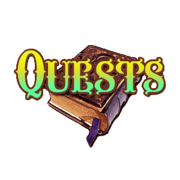

# 👋 WELCOME EVERYBODY!

> *Want to watch a Welcome Video instead of reading this text? You can watch <a href="" target="_blank">here</a>.*

## 📖 What is this course?

This is a course created by <a href="https://academy.ecdao.org" target="_blank">Emerald Academy</a>. It is meant to teach you all about smart contract security / auditing... what those are, why they're important, and how to best implement them.

While we cover general topics that can be applied across any blockchain, this course is done entirely in the context of the <a href="https://flow.com">Flow blockchain</a>, and more specifically, the Cadence Smart Contract language.

## 🚀 What will I know by the end?

- How to increase the safety of your contracts / transactions
- How to increase the efficiency of your contracts / transactions
- How to increase the readability & understandability of your Cadence code
- How to audit Cadence code

## 🔖 What will I create?

## 😇 Who is this course meant for?

- People with a solid understanding of the Cadence language. If you have completed our <a href="https://github.com/emerald-dao/beginner-cadence-course">Beginner Cadence Course</a>, you are good to go.
- Want to become a better (and safer) Cadence developer to prevent bugs in your Smart Contracts
- Want to better understand *how* and *why* contracts often become vulnerable, and how to prevent it
- Want to ensure your own safety from a user perspective when interacting with the blockchain so you aren't being hacked yourself
- Want to become an auditor for programs like <a href="https://ecdao.org/shield">Emerald Shield</a>.

## 📚 How does it work?

The lessons will be split into "chapters," and chapters will be split into "days." I did it this way so you can manage your time and progress through the course as you like. Do not feel pressured to do this every day. Do it at your own pace and have fun with it! It will always be here :)

Here's an overview:
- Lessons split into days
- Written & video content associated with each day. The videos will be from my [YouTube Channel](https://www.youtube.com/channel/UCf6DzMRwj7SJ3nPrZqd5hHw).
- Quests to complete
- A completion certificate (<a href="">this FLOAT</a>) if you have completed all the quests from Chapters 1-5 (Chapter 6 is extra credit). This will be proof that you have significant Cadence knowledge, and you will be able to show it to whoever you like as proof of expertise. Or just for fun! :D

## ❓ What do I need ahead of time?

A solid understanding of the Cadence language. If you have completed our <a href="https://github.com/emerald-dao/beginner-cadence-course">Beginner Cadence Course</a>, you are good to go.

## 📁 What are quests?

Quests are like homework assignments. There are quests for every day of content. They will test your understanding of the concepts that are in that day's content. 

## 🙋 How to Submit Quests

When you finish a quest, please store all your quests together. Then, when you want them to be reviewed, submit them in the #quest-submissions channel inside the [Emerald City DAO Discord](https://discord.gg/z6zgjr7HEm) and our instructors will review them.

*Note: The Emerald City DAO is the first DAO on the Flow Blockchain. I founded it in November 2021 and it has some amazing people in it! We are dedicated to teaching people all about Flow and Cadence, as well as building the tooling for all DAOs on Flow. If you'd like to learn more about it or learn how to get involved, please join our [Discord](https://discord.gg/emeraldcity).*

## 📝 Quizzes

Every day *also* has a quiz associated with it to test your knowledge. It is a simple Google Form you can fill out to test your understanding for that day's content.

*All of these quizzes are entirely thanks to FrankenSense. Thank you for being an absolute legend!*

## 🇺🇸 Multilingual Support

This course is currently available in English (README.md), Chinese (README_ZH.md), Spanish (README_ES.md), and Russian (README_RU.md). Under each day of content, you will see a matching README file for your language of choice.

## 🚗 When can I start?

Whenever you want my friend! :)

You can start the first day [here](https://github.com/emerald-dao/cadence-security-and-auditing-course/tree/main/chapter1.0/day1).

## 💚 Emerald Academy

This course was created by <a href="https://academy.ecdao.org" target="_blank">Emerald Academy</a>, which is a series of educational resources & bootcamps created by your *best* friends at <a href="https://ecdao.org/" target="_blank">Emerald City</a>. If you're interested in more educational content or getting involved in the broader Emerald City community, come join our <a href="https://discord.gg/emeraldcity" target="_blank">Discord</a> :)

## 🏁 Ending Remarks

If you have any feedback, please let me know. You can message me on Twitter, on Discord, on YouTube, anything. I am not smarter than any of you. If you have suggestions, I am sure they are great and I'd love to hear them.

Feel free to reach out to me on any of these platforms:

[Twitter](https://twitter.com/jacobmtucker)

[YouTube](https://www.youtube.com/channel/UCf6DzMRwj7SJ3nPrZqd5hHw)

Discord: tsnakejake#8364
